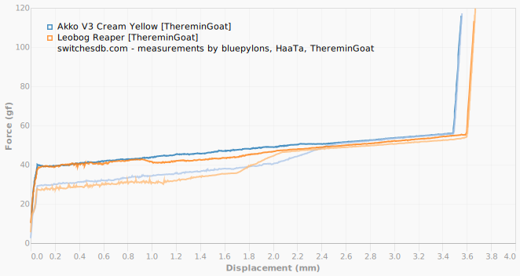

# Force-curves of 1473 switches

This is a [fork](https://github.com/ThereminGoat/force-curves) of the work from https://www.theremingoat.com/.

## Comparison website

Three larger projects to collect switch force curves are from [HaaTa](https://chart-studio.plotly.com/~haata#/), [ThereminGoat](https://github.com/ThereminGoat/force-curves) and [bluepylons](https://github.com/bluepylons/Open-Switch-Curve-Meter). In [January 2023](https://deskthority.net/viewtopic.php?t=27819) a member of [Deskthority](https://deskthority.net/) forum (with their [wiki page](https://deskthority.net/wiki/)) created a website to view and compare more than 2200 switches:

<a href="https://www.switchesdb.com/">https://www.switchesdb.com/  </a>

Here are two example comparison images from this database:

 

## Switches in this repository

### A

[A Switch With No Good Name](data/A%20Switch%20With%20No%20Good%20Name/A%20Switch%20With%20No%20Good%20Name.pdf) | 
[Aflion Black and Orange](data/Aflion%20Black%20and%20Orange/Aflion%20Black%20and%20Orange.pdf) | 
[Aflion Black and Orange](https://kreier.github.io/force-curves/_data/Aflion%20Black%20and%20Orange/Aflion%20Black%20and%20Orange.pdf) |
[Aflion Blue Sky](https://kreier.github.io/force-curves/_data/Aflion%20Blue%20Sky/Aflion%20Blue%20Sky.pdf) |
[Aflion Blush](https://kreier.github.io/force-curves/_data/Aflion%20Blush/Aflion%20Blush.pdf) |
[Aflion Cloudy Shadow](https://kreier.github.io/force-curves/_data/Aflion%20Cloudy%20Shadow/Aflion%20Cloudy%20Shadow.pdf) |
[Aflion Foggy Shadow](https://kreier.github.io/force-curves/_data/Aflion%20Foggy%20Shadow/Aflion%20Foggy%20Shadow.pdf) |
[Aflion Heavy Yellow Sample](https://kreier.github.io/force-curves/_data/Aflion%20Heavy%20Yellow%20Sample/Aflion%20Heavy%20Yellow%20Sample.pdf) |
[Aflion Holy Panda](https://kreier.github.io/force-curves/_data/Aflion%20Holy%20Panda/Aflion%20Holy%20Panda.pdf) |
[Aflion Iceberg Orange V2](https://kreier.github.io/force-curves/_data/Aflion%20Iceberg%20Orange%20V2/Aflion%20Iceberg%20Orange%20V2.pdf) |
[Aflion Iceberg Pink V2](https://kreier.github.io/force-curves/_data/Aflion%20Iceberg%20Pink%20V2/Aflion%20Iceberg%20Pink%20V2.pdf) |
[Aflion Iceberg Purple V2](https://kreier.github.io/force-curves/_data/Aflion%20Iceberg%20Purple%20V2/Aflion%20Iceberg%20Purple%20V2.pdf) |
[Aflion Iceberg Rainbow Blue](https://kreier.github.io/force-curves/_data/Aflion%20Iceberg%20Rainbow%20Blue/Aflion%20Iceberg%20Rainbow%20Blue.pdf) |
[Aflion Iceberg Red V2](https://kreier.github.io/force-curves/_data/Aflion%20Iceberg%20Red%20V2/Aflion%20Iceberg%20Red%20V2.pdf) |
[Aflion Iceberg Teal V2](https://kreier.github.io/force-curves/_data/Aflion%20Iceberg%20Teal%20V2/Aflion%20Iceberg%20Teal%20V2.pdf) |
[Aflion Iceberg Yellow V2](https://kreier.github.io/force-curves/_data/Aflion%20Iceberg%20Yellow%20V2/Aflion%20Iceberg%20Yellow%20V2.pdf) |
[Aflion Thunder Shadow](https://kreier.github.io/force-curves/_data/Aflion%20Thunder%20Shadow/Aflion%20Thunder%20Shadow.pdf) |
[Aflion Tropical Waters](https://kreier.github.io/force-curves/_data/Aflion%20Tropical%20Waters/Aflion%20Tropical%20Waters.pdf) |
[Aflion Windy Shadow](https://kreier.github.io/force-curves/_data/Aflion%20Windy%20Shadow/Aflion%20Windy%20Shadow.pdf) |
[Agile Moon](https://kreier.github.io/force-curves/_data/Agile%20Moon/Agile%20Moon.pdf) |
[Aiguox Dark Sakura Glass](https://kreier.github.io/force-curves/_data/Aiguox%20Dark%20Sakura%20Glass/Aiguox%20Dark%20Sakura%20Glass.pdf) |
[Aiguox Little Bear](https://kreier.github.io/force-curves/_data/Aiguox%20Little%20Bear/Aiguox%20Little%20Bear.pdf) |
[Ajazz AS 001 Red](https://kreier.github.io/force-curves/_data/Ajazz%20AS%20001%20Red/Ajazz%20AS%20001%20Red.pdf) |
[Ajazz AS Coral Pink](https://kreier.github.io/force-curves/_data/Ajazz%20AS%20Coral%20Pink/Ajazz%20AS%20Coral%20Pink.pdf) |
[Ajazz AS Foggy Mountain Green](https://kreier.github.io/force-curves/_data/Ajazz%20AS%20Foggy%20Mountain%20Green/Ajazz%20AS%20Foggy%20Mountain%20Green.pdf) |
[Ajazz AS Royal Yellow](https://kreier.github.io/force-curves/_data/Ajazz%20AS%20Royal%20Yellow/Ajazz%20AS%20Royal%20Yellow.pdf) |
[Ajazz AS Sky Blue](https://kreier.github.io/force-curves/_data/Ajazz%20AS%20Sky%20Blue/Ajazz%20AS%20Sky%20Blue.pdf) |
[Ajazz Black (Black Bottom)](https://kreier.github.io/force-curves/_data/Ajazz%20Black%20(Black%20Bottom)/Ajazz%20Black%20(Black%20Bottom).pdf) |
[Ajazz Blue (Black Bottom)](https://kreier.github.io/force-curves/_data/Ajazz%20Blue%20(Black%20Bottom)/Ajazz%20Blue%20(Black%20Bottom).pdf) |
[Ajazz Brown (Clear Top, Black Bottom)](https://kreier.github.io/force-curves/_data/Ajazz%20Brown%20(Clear%20Top,%20Black%20Bottom)/Ajazz%20Brown%20(Clear%20Top,%20Black%20Bottom).pdf) |
[Ajazz Doyu Orange](https://kreier.github.io/force-curves/_data/Ajazz%20Doyu%20Orange/Ajazz%20Doyu%20Orange.pdf) |
[Ajazz Doyu White](https://kreier.github.io/force-curves/_data/Ajazz%20Doyu%20White/Ajazz%20Doyu%20White.pdf) |
[Ajazz Flying Fish](https://kreier.github.io/force-curves/_data/Ajazz%20Flying%20Fish/Ajazz%20Flying%20Fish.pdf) |
[Ajazz Green Plum](https://kreier.github.io/force-curves/_data/Ajazz%20Green%20Plum/Ajazz%20Green%20Plum.pdf) |
[Ajazz Moon](https://kreier.github.io/force-curves/_data/Ajazz%20Moon/Ajazz%20Moon.pdf) |
[Ajazz Purple](https://kreier.github.io/force-curves/_data/Ajazz%20Purple/Ajazz%20Purple.pdf) |
[Ajazz Purple (Black Bottom)](https://kreier.github.io/force-curves/_data/Ajazz%20Purple%20(Black%20Bottom)/Ajazz%20Purple%20(Black%20Bottom).pdf) |
[Ajazz Sea Salt](https://kreier.github.io/force-curves/_data/Ajazz%20Sea%20Salt/Ajazz%20Sea%20Salt.pdf) |
[Ajazz x Huano Banana](https://kreier.github.io/force-curves/_data/Ajazz%20x%20Huano%20Banana/Ajazz%20x%20Huano%20Banana.pdf) |
[Ajazz x Huano Peach](https://kreier.github.io/force-curves/_data/Ajazz%20x%20Huano%20Peach/Ajazz%20x%20Huano%20Peach.pdf) |
[Akko Air](https://kreier.github.io/force-curves/_data/Akko%20Air/Akko%20Air.pdf) |
[Akko Blue V2](https://kreier.github.io/force-curves/_data/Akko%20Blue%20V2/Akko%20Blue%20V2.pdf) |
[Akko Botany](https://kreier.github.io/force-curves/_data/Akko%20Botany/Akko%20Botany.pdf) |
[Akko Cream Black V3 Pro](https://kreier.github.io/force-curves/_data/Akko%20Cream%20Black%20V3%20Pro/Akko%20Cream%20Black%20V3%20Pro.pdf) |
[Akko Creamy Cyan](https://kreier.github.io/force-curves/_data/Akko%20Creamy%20Cyan/Akko%20Creamy%20Cyan.pdf) |
[Akko Crystal](https://kreier.github.io/force-curves/_data/Akko%20Crystal/Akko%20Crystal.pdf) |
[Akko Crystal Blue](https://kreier.github.io/force-curves/_data/Akko%20Crystal%20Blue/Akko%20Crystal%20Blue.pdf) |
[Akko Crystal Silver](https://kreier.github.io/force-curves/_data/Akko%20Crystal%20Silver/Akko%20Crystal%20Silver.pdf) |
[Akko Crystal Wine Red](https://kreier.github.io/force-curves/_data/Akko%20Crystal%20Wine%20Red/Akko%20Crystal%20Wine%20Red.pdf) |
[Akko CS Jelly Black](https://kreier.github.io/force-curves/_data/Akko%20CS%20Jelly%20Black/Akko%20CS%20Jelly%20Black.pdf) |
[Akko CS Jelly Blue](https://kreier.github.io/force-curves/_data/Akko%20CS%20Jelly%20Blue/Akko%20CS%20Jelly%20Blue.pdf) |
[Akko CS Jelly Pink](https://kreier.github.io/force-curves/_data/Akko%20CS%20Jelly%20Pink/Akko%20CS%20Jelly%20Pink.pdf) |
[Akko CS Jelly Purple](https://kreier.github.io/force-curves/_data/Akko%20CS%20Jelly%20Purple/Akko%20CS%20Jelly%20Purple.pdf) |
[Akko CS Jelly White](https://kreier.github.io/force-curves/_data/Akko%20CS%20Jelly%20White/Akko%20CS%20Jelly%20White.pdf) |
[Akko CS Lavender Purple](https://kreier.github.io/force-curves/_data/Akko%20CS%20Lavender%20Purple/Akko%20CS%20Lavender%20Purple.pdf) |
[Akko CS Radiant Red](https://kreier.github.io/force-curves/_data/Akko%20CS%20Radiant%20Red/Akko%20CS%20Radiant%20Red.pdf) |
[Akko CS Sponge](https://kreier.github.io/force-curves/_data/Akko%20CS%20Sponge/Akko%20CS%20Sponge.pdf) |
[Akko CS Starfish](https://kreier.github.io/force-curves/_data/Akko%20CS%20Starfish/Akko%20CS%20Starfish.pdf) |
[Akko CS Vintage White](https://kreier.github.io/force-curves/_data/Akko%20CS%20Vintage%20White/Akko%20CS%20Vintage%20White.pdf) |
[Akko CS Wine White](https://kreier.github.io/force-curves/_data/Akko%20CS%20Wine%20White/Akko%20CS%20Wine%20White.pdf) |
[Akko Dracula](https://kreier.github.io/force-curves/_data/Akko%20Dracula/Akko%20Dracula.pdf) |
[Akko Hall Effect Cream Yellow](https://kreier.github.io/force-curves/_data/Akko%20Hall%20Effect%20Cream%20Yellow/Akko%20Hall%20Effect%20Cream%20Yellow.pdf) |
[Akko Hall Effect Sakura Pink](https://kreier.github.io/force-curves/_data/Akko%20Hall%20Effect%20Sakura%20Pink/Akko%20Hall%20Effect%20Sakura%20Pink.pdf) |
[Akko Haze Pink](https://kreier.github.io/force-curves/_data/Akko%20Haze%20Pink/Akko%20Haze%20Pink.pdf) |
[Akko Ice Cream Pink](https://kreier.github.io/force-curves/_data/Akko%20Ice%20Cream%20Pink/Akko%20Ice%20Cream%20Pink.pdf) |
[Akko Ice Cream Purple](https://kreier.github.io/force-curves/_data/Akko%20Ice%20Cream%20Purple/Akko%20Ice%20Cream%20Purple.pdf) |
[Akko Lavender Purple V3 Pro](https://kreier.github.io/force-curves/_data/Akko%20Lavender%20Purple%20V3%20Pro/Akko%20Lavender%20Purple%20V3%20Pro.pdf) |
[Akko Matcha Green V3 Pro](https://kreier.github.io/force-curves/_data/Akko%20Matcha%20Green%20V3%20Pro/Akko%20Matcha%20Green%20V3%20Pro.pdf) |
[Akko Orange V1](https://kreier.github.io/force-curves/_data/Akko%20Orange%20V1/Akko%20Orange%20V1.pdf) |
[Akko Piano](https://kreier.github.io/force-curves/_data/Akko%20Piano/Akko%20Piano.pdf) |
[Akko Piano Pro V3 (Condenser)](https://kreier.github.io/force-curves/_data/Akko%20Piano%20Pro%20V3%20(Condenser)/Akko%20Piano%20Pro%20V3%20(Condenser).pdf) |
[Akko Piano V3 Pro](https://kreier.github.io/force-curves/_data/Akko%20Piano%20V3%20Pro/Akko%20Piano%20V3%20Pro.pdf) |
[Akko Pink V2](https://kreier.github.io/force-curves/_data/Akko%20Pink%20V2/Akko%20Pink%20V2.pdf) |
[Akko POM Brown](https://kreier.github.io/force-curves/_data/Akko%20POM%20Brown/Akko%20POM%20Brown.pdf) |
[Akko POM Pink](https://kreier.github.io/force-curves/_data/Akko%20POM%20Pink/Akko%20POM%20Pink.pdf) |
[Akko POM Silver](https://kreier.github.io/force-curves/_data/Akko%20POM%20Silver/Akko%20POM%20Silver.pdf) |
[Akko Rosewood](https://kreier.github.io/force-curves/_data/Akko%20Rosewood/Akko%20Rosewood.pdf) |
[Akko Silver V3 Pro](https://kreier.github.io/force-curves/_data/Akko%20Silver%20V3%20Pro/Akko%20Silver%20V3%20Pro.pdf) |
[Akko Snow Blue Grey](https://kreier.github.io/force-curves/_data/Akko%20Snow%20Blue%20Grey/Akko%20Snow%20Blue%20Grey.pdf) |
[Akko Stellar Rose](https://kreier.github.io/force-curves/_data/Akko%20Stellar%20Rose/Akko%20Stellar%20Rose.pdf) |
[Akko V3 Cream Blue](https://kreier.github.io/force-curves/_data/Akko%20V3%20Cream%20Blue/Akko%20V3%20Cream%20Blue.pdf) |
[Akko V3 Cream Blue Pro](https://kreier.github.io/force-curves/_data/Akko%20V3%20Cream%20Blue%20Pro/Akko%20V3%20Cream%20Blue%20Pro.pdf) |
[Akko V3 Cream Yellow](https://kreier.github.io/force-curves/_data/Akko%20V3%20Cream%20Yellow/Akko%20V3%20Cream%20Yellow.pdf) |
[Akko V3 Cream Yellow Pro](https://kreier.github.io/force-curves/_data/Akko%20V3%20Cream%20Yellow%20Pro/Akko%20V3%20Cream%20Yellow%20Pro.pdf) |
[Akko V3 Creamy Purple Pro](https://kreier.github.io/force-curves/_data/Akko%20V3%20Creamy%20Purple%20Pro/Akko%20V3%20Creamy%20Purple%20Pro.pdf) |
[Akko Wine Red](https://kreier.github.io/force-curves/_data/Akko%20Wine%20Red/Akko%20Wine%20Red.pdf) |
[Akko x Gateron White](https://kreier.github.io/force-curves/_data/Akko%20x%20Gateron%20White/Akko%20x%20Gateron%20White.pdf) |
[Akko x Gateron Yellow](https://kreier.github.io/force-curves/_data/Akko%20x%20Gateron%20Yellow/Akko%20x%20Gateron%20Yellow.pdf) |
[All Clack](https://kreier.github.io/force-curves/_data/All%20Clack/All%20Clack.pdf) |
[AngryMiao Cyberswitch](https://kreier.github.io/force-curves/_data/AngryMiao%20Cyberswitch/AngryMiao%20Cyberswitch.pdf) |
[Aristotle White](https://kreier.github.io/force-curves/_data/Aristotle%20White/Aristotle%20White.pdf) |
[Asus Rog NX Blue](https://kreier.github.io/force-curves/_data/Asus%20Rog%20NX%20Blue/Asus%20Rog%20NX%20Blue.pdf) |
[Asus Rog NX Brown](https://kreier.github.io/force-curves/_data/Asus%20Rog%20NX%20Brown/Asus%20Rog%20NX%20Brown.pdf) |
[Asus Rog NX Red](https://kreier.github.io/force-curves/_data/Asus%20Rog%20NX%20Red/Asus%20Rog%20NX%20Red.pdf) |
[ASUS Rog Snow](https://kreier.github.io/force-curves/_data/ASUS%20Rog%20Snow/ASUS%20Rog%20Snow.pdf) |
[ASUS Rog Storm](https://kreier.github.io/force-curves/_data/ASUS%20Rog%20Storm/ASUS%20Rog%20Storm.pdf) |
[Attack Shark Blue Jelly](https://kreier.github.io/force-curves/_data/Attack%20Shark%20Blue%20Jelly/Attack%20Shark%20Blue%20Jelly.pdf) |
[Attack Shark Green Jelly](https://kreier.github.io/force-curves/_data/Attack%20Shark%20Green%20Jelly/Attack%20Shark%20Green%20Jelly.pdf) |
[Attack Shark White](https://kreier.github.io/force-curves/_data/Attack%20Shark%20White/Attack%20Shark%20White.pdf) |
[Attack Shark Yellow](https://kreier.github.io/force-curves/_data/Attack%20Shark%20Yellow/Attack%20Shark%20Yellow.pdf)

### B

[Backspace Black Jade HE](https://kreier.github.io/force-curves/_data/Backspace%20Black%20Jade%20HE/Backspace%20Black%20Jade%20HE.pdf) |
[Bald Brother Jagor Ice Cream V2](https://kreier.github.io/force-curves/_data/Bald%20Brother%20Jagor%20Ice%20Cream%20V2/Bald%20Brother%20Jagor%20Ice%20Cream%20V2.pdf) |
[Bald Brother Jagor Ice Grass V2](https://kreier.github.io/force-curves/_data/Bald%20Brother%20Jagor%20Ice%20Grass%20V2/Bald%20Brother%20Jagor%20Ice%20Grass%20V2.pdf) |
[Bald Brother Jagor Ice Lemon V3](https://kreier.github.io/force-curves/_data/Bald%20Brother%20Jagor%20Ice%20Lemon%20V3/Bald%20Brother%20Jagor%20Ice%20Lemon%20V3.pdf) |
[Banana Milk Linear Factory Sample](https://kreier.github.io/force-curves/_data/Banana%20Milk%20Linear%20Factory%20Sample/Banana%20Milk%20Linear%20Factory%20Sample.pdf) |
[Banana Milk Tactile](https://kreier.github.io/force-curves/_data/Banana%20Milk%20Tactile/Banana%20Milk%20Tactile.pdf) |
[Banana Milk Tactile Factory Sample](https://kreier.github.io/force-curves/_data/Banana%20Milk%20Tactile%20Factory%20Sample/Banana%20Milk%20Tactile%20Factory%20Sample.pdf) |
[Batknight Black](https://kreier.github.io/force-curves/_data/Batknight%20Black/Batknight%20Black.pdf) |
[Batknight Blue](https://kreier.github.io/force-curves/_data/Batknight%20Blue/Batknight%20Blue.pdf) |
[Batknight Navy V2](https://kreier.github.io/force-curves/_data/Batknight%20Navy%20V2/Batknight%20Navy%20V2.pdf) |
[Batknight Obedient V2](https://kreier.github.io/force-curves/_data/Batknight%20Obedient%20V2/Batknight%20Obedient%20V2.pdf) |
[Batknight Red](https://kreier.github.io/force-curves/_data/Batknight%20Red/Batknight%20Red.pdf) |
[Batknight Split Front Green](https://kreier.github.io/force-curves/_data/Batknight%20Split%20Front%20Green/Batknight%20Split%20Front%20Green.pdf) |
[BBN (Tactile)](https://kreier.github.io/force-curves/_data/BBN%20(Tactile)/BBN%20(Tactile).pdf) |
[BBN Linear](https://kreier.github.io/force-curves/_data/BBN%20Linear/BBN%20Linear.pdf) |
[Betty](https://kreier.github.io/force-curves/_data/Betty/Betty.pdf) |
[Bingsu POM](https://kreier.github.io/force-curves/_data/Bingsu%20POM/Bingsu%20POM.pdf) |
[Black Cherry Pie](https://kreier.github.io/force-curves/_data/Black%20Cherry%20Pie/Black%20Cherry%20Pie.pdf) |
[Black Geon Switch](https://kreier.github.io/force-curves/_data/Black%20Geon%20Switch/Black%20Geon%20Switch.pdf) |
[Blaeck](https://kreier.github.io/force-curves/_data/Blaeck/Blaeck.pdf) |
[Blue Lotus](https://kreier.github.io/force-curves/_data/Blue%20Lotus/Blue%20Lotus.pdf) |
[Bluejay](https://kreier.github.io/force-curves/_data/Bluejay/Bluejay.pdf) |
[Bobagum (62g)](https://kreier.github.io/force-curves/_data/Bobagum%20(62g)/Bobagum%20(62g).pdf) |
[Bolsa Namazu](https://kreier.github.io/force-curves/_data/Bolsa%20Namazu/Bolsa%20Namazu.pdf) |
[Bonbonera POM Pink](https://kreier.github.io/force-curves/_data/Bonbonera%20POM%20Pink/Bonbonera%20POM%20Pink.pdf) |
[Brazilian Iron](https://kreier.github.io/force-curves/_data/Brazilian%20Iron/Brazilian%20Iron.pdf) |
[BSUN 5 Pin Blue Panda](https://kreier.github.io/force-curves/_data/BSUN%205%20Pin%20Blue%20Panda/BSUN%205%20Pin%20Blue%20Panda.pdf) |
[BSUN 5 Pin Green Panda](https://kreier.github.io/force-curves/_data/BSUN%205%20Pin%20Green%20Panda/BSUN%205%20Pin%20Green%20Panda.pdf) |
[BSUN 5 Pin Red Panda](https://kreier.github.io/force-curves/_data/BSUN%205%20Pin%20Red%20Panda/BSUN%205%20Pin%20Red%20Panda.pdf) |
[BSUN 5 Pin White Panda](https://kreier.github.io/force-curves/_data/BSUN%205%20Pin%20White%20Panda/BSUN%205%20Pin%20White%20Panda.pdf) |
[BSUN 5 Pin Yellow Panda](https://kreier.github.io/force-curves/_data/BSUN%205%20Pin%20Yellow%20Panda/BSUN%205%20Pin%20Yellow%20Panda.pdf) |
[BSUN Avocado Panda V2](https://kreier.github.io/force-curves/_data/BSUN%20Avocado%20Panda%20V2/BSUN%20Avocado%20Panda%20V2.pdf) |
[BSUN Bitao](https://kreier.github.io/force-curves/_data/BSUN%20Bitao/BSUN%20Bitao.pdf) |
[BSUN Crystal Light Blue](https://kreier.github.io/force-curves/_data/BSUN%20Crystal%20Light%20Blue/BSUN%20Crystal%20Light%20Blue.pdf) |
[BSUN Crystal White](https://kreier.github.io/force-curves/_data/BSUN%20Crystal%20White/BSUN%20Crystal%20White.pdf) |
[BSUN Dragon Fruit Panda V2](https://kreier.github.io/force-curves/_data/BSUN%20Dragon%20Fruit%20Panda%20V2/BSUN%20Dragon%20Fruit%20Panda%20V2.pdf) |
[BSUN Dustproof Blue](https://kreier.github.io/force-curves/_data/BSUN%20Dustproof%20Blue/BSUN%20Dustproof%20Blue.pdf) |
[BSUN Dustproof Blue (Condenser)](https://kreier.github.io/force-curves/_data/BSUN%20Dustproof%20Blue%20(Condenser)/BSUN%20Dustproof%20Blue%20(Condenser).pdf) |
[BSUN Dustproof Brown (White Bottom)](https://kreier.github.io/force-curves/_data/BSUN%20Dustproof%20Brown%20(White%20Bottom)/BSUN%20Dustproof%20Brown%20(White%20Bottom).pdf) |
[BSUN Ginseng Fruit](https://kreier.github.io/force-curves/_data/BSUN%20Ginseng%20Fruit/BSUN%20Ginseng%20Fruit.pdf) |
[BSUN Guyu](https://kreier.github.io/force-curves/_data/BSUN%20Guyu/BSUN%20Guyu.pdf) |
[BSUN Light Switch](https://kreier.github.io/force-curves/_data/BSUN%20Light%20Switch/BSUN%20Light%20Switch.pdf) |
[BSUN Lychee Black](https://kreier.github.io/force-curves/_data/BSUN%20Lychee%20Black/BSUN%20Lychee%20Black.pdf) |
[BSUN Lychee Red](https://kreier.github.io/force-curves/_data/BSUN%20Lychee%20Red/BSUN%20Lychee%20Red.pdf) |
[BSUN Milktea Siam V2](https://kreier.github.io/force-curves/_data/BSUN%20Milktea%20Siam%20V2/BSUN%20Milktea%20Siam%20V2.pdf) |
[BSUN Peach Pride](https://kreier.github.io/force-curves/_data/BSUN%20Peach%20Pride/BSUN%20Peach%20Pride.pdf) |
[BSUN Pikachu](https://kreier.github.io/force-curves/_data/BSUN%20Pikachu/BSUN%20Pikachu.pdf) |
[BSUN Polar Panda V2](https://kreier.github.io/force-curves/_data/BSUN%20Polar%20Panda%20V2/BSUN%20Polar%20Panda%20V2.pdf) |
[BSUN POM Panda Black](https://kreier.github.io/force-curves/_data/BSUN%20POM%20Panda%20Black/BSUN%20POM%20Panda%20Black.pdf) |
[BSUN POM Panda Red](https://kreier.github.io/force-curves/_data/BSUN%20POM%20Panda%20Red/BSUN%20POM%20Panda%20Red.pdf) |
[BSUN Racoon Panda V2](https://kreier.github.io/force-curves/_data/BSUN%20Racoon%20Panda%20V2/BSUN%20Racoon%20Panda%20V2.pdf) |
[BSUN Smoky Pink Tactile](https://kreier.github.io/force-curves/_data/BSUN%20Smoky%20Pink%20Tactile/BSUN%20Smoky%20Pink%20Tactile.pdf) |
[BSUN Strawberry Cheesecake](https://kreier.github.io/force-curves/_data/BSUN%20Strawberry%20Cheesecake/BSUN%20Strawberry%20Cheesecake.pdf) |
[BSUN Translucent Panda 3 Pin](https://kreier.github.io/force-curves/_data/BSUN%20Translucent%20Panda%203%20Pin/BSUN%20Translucent%20Panda%203%20Pin.pdf) |
[BSUN Tuzi](https://kreier.github.io/force-curves/_data/BSUN%20Tuzi/BSUN%20Tuzi.pdf) |
[BSUN Yellow (Clear_White)](https://kreier.github.io/force-curves/_data/BSUN%20Yellow%20(Clear_White)/BSUN%20Yellow%20(Clear_White).pdf) |
[Buri Diamond](https://kreier.github.io/force-curves/_data/Buri%20Diamond/Buri%20Diamond.pdf) 

### C

[C&K Black](https://kreier.github.io/force-curves/_data/C&K%20Black/C&K%20Black.pdf) |
[C3 Equalz Tangerine V2 (62g)](https://kreier.github.io/force-curves/_data/C3%20Equalz%20Tangerine%20V2%20(62g)/C3%20Equalz%20Tangerine%20V2%20(62g).pdf) |
[C3 Kiwi](https://kreier.github.io/force-curves/_data/C3%20Kiwi/C3%20Kiwi.pdf) |
[Ca Phe Sua Da](https://kreier.github.io/force-curves/_data/Ca%20Phe%20Sua%20Da/Ca%20Phe%20Sua%20Da.pdf) |
[Cardinal](https://kreier.github.io/force-curves/_data/Cardinal/Cardinal.pdf) |
[CHAOSERA Klein](https://kreier.github.io/force-curves/_data/CHAOSERA%20Klein/CHAOSERA%20Klein.pdf) |
[Cherry Blossom](https://kreier.github.io/force-curves/_data/Cherry%20Blossom/Cherry%20Blossom.pdf) |
[Cherry Hirose Clear](https://kreier.github.io/force-curves/_data/Cherry%20Hirose%20Clear/Cherry%20Hirose%20Clear.pdf) |
[Cherry Hirose Orange](https://kreier.github.io/force-curves/_data/Cherry%20Hirose%20Orange/Cherry%20Hirose%20Orange.pdf) |
[Cherry MX Black (3 Pin)](https://kreier.github.io/force-curves/_data/Cherry%20MX%20Black%20(3%20Pin)/Cherry%20MX%20Black%20(3%20Pin).pdf) |
[Cherry MX Blue (3 Pin)](https://kreier.github.io/force-curves/_data/Cherry%20MX%20Blue%20(3%20Pin)/Cherry%20MX%20Blue%20(3%20Pin).pdf) |
[Cherry MX Blue (5 Pin)](https://kreier.github.io/force-curves/_data/Cherry%20MX%20Blue%20(5%20Pin)/Cherry%20MX%20Blue%20(5%20Pin).pdf) |
[Cherry MX Brown (3 Pin)](https://kreier.github.io/force-curves/_data/Cherry%20MX%20Brown%20(3%20Pin)/Cherry%20MX%20Brown%20(3%20Pin).pdf) |
[Cherry MX Clear (3 Pin)](https://kreier.github.io/force-curves/_data/Cherry%20MX%20Clear%20(3%20Pin)/Cherry%20MX%20Clear%20(3%20Pin).pdf) |
[Cherry MX Clear (5 Pin)](https://kreier.github.io/force-curves/_data/Cherry%20MX%20Clear%20(5%20Pin)/Cherry%20MX%20Clear%20(5%20Pin).pdf) |
[Cherry MX Ergo Clear (3 Pin)](https://kreier.github.io/force-curves/_data/Cherry%20MX%20Ergo%20Clear%20(3%20Pin)/Cherry%20MX%20Ergo%20Clear%20(3%20Pin).pdf) |
[Cherry MX Ergo Clear (5 Pin)](https://kreier.github.io/force-curves/_data/Cherry%20MX%20Ergo%20Clear%20(5%20Pin)/Cherry%20MX%20Ergo%20Clear%20(5%20Pin).pdf) |
[Cherry MX Green (3 Pin)](https://kreier.github.io/force-curves/_data/Cherry%20MX%20Green%20(3%20Pin)/Cherry%20MX%20Green%20(3%20Pin).pdf) |
[Cherry MX Grey (5 Pin)](https://kreier.github.io/force-curves/_data/Cherry%20MX%20Grey%20(5%20Pin)/Cherry%20MX%20Grey%20(5%20Pin).pdf) |
[Cherry MX Hyperglide Black (3 Pin)](https://kreier.github.io/force-curves/_data/Cherry%20MX%20Hyperglide%20Black%20(3%20Pin)/Cherry%20MX%20Hyperglide%20Black%20(3%20Pin).pdf) |
[Cherry MX Hyperglide Black (5 Pin)](https://kreier.github.io/force-curves/_data/Cherry%20MX%20Hyperglide%20Black%20(5%20Pin)/Cherry%20MX%20Hyperglide%20Black%20(5%20Pin).pdf) |
[Cherry MX Hyperglide Brown (3 Pin)](https://kreier.github.io/force-curves/_data/Cherry%20MX%20Hyperglide%20Brown%20(3%20Pin)/Cherry%20MX%20Hyperglide%20Brown%20(3%20Pin).pdf) |
[Cherry MX Hyperglide Brown (5 Pin)](https://kreier.github.io/force-curves/_data/Cherry%20MX%20Hyperglide%20Brown%20(5%20Pin)/Cherry%20MX%20Hyperglide%20Brown%20(5%20Pin).pdf) |
[Cherry MX Jailhouse Blue](https://kreier.github.io/force-curves/_data/Cherry%20MX%20Jailhouse%20Blue/Cherry%20MX%20Jailhouse%20Blue.pdf) |
[Cherry MX Linear Grey (3 Pin)](https://kreier.github.io/force-curves/_data/Cherry%20MX%20Linear%20Grey%20(3%20Pin)/Cherry%20MX%20Linear%20Grey%20(3%20Pin).pdf) |
[Cherry MX Orange](https://kreier.github.io/force-curves/_data/Cherry%20MX%20Orange/Cherry%20MX%20Orange.pdf) |
[Cherry MX Red (3 Pin)](https://kreier.github.io/force-curves/_data/Cherry%20MX%20Red%20(3%20Pin)/Cherry%20MX%20Red%20(3%20Pin).pdf) |
[Cherry MX Red (5 Pin)](https://kreier.github.io/force-curves/_data/Cherry%20MX%20Red%20(5%20Pin)/Cherry%20MX%20Red%20(5%20Pin).pdf) |
[Cherry MX RGB Black (3 Pin)](https://kreier.github.io/force-curves/_data/Cherry%20MX%20RGB%20Black%20(3%20Pin)/Cherry%20MX%20RGB%20Black%20(3%20Pin).pdf) |
[Cherry MX RGB Blue (5 Pin)](https://kreier.github.io/force-curves/_data/Cherry%20MX%20RGB%20Blue%20(5%20Pin)/Cherry%20MX%20RGB%20Blue%20(5%20Pin).pdf) |
[Cherry MX RGB Ergo Clear (5 Pin)](https://kreier.github.io/force-curves/_data/Cherry%20MX%20RGB%20Ergo%20Clear%20(5%20Pin)/Cherry%20MX%20RGB%20Ergo%20Clear%20(5%20Pin).pdf) |
[Cherry MX RGB Red (5 Pin)](https://kreier.github.io/force-curves/_data/Cherry%20MX%20RGB%20Red%20(5%20Pin)/Cherry%20MX%20RGB%20Red%20(5%20Pin).pdf) |
[Cherry MX RGB Silent Red (3 Pin)](https://kreier.github.io/force-curves/_data/Cherry%20MX%20RGB%20Silent%20Red%20(3%20Pin)/Cherry%20MX%20RGB%20Silent%20Red%20(3%20Pin).pdf) |
[Cherry MX Silent Black (5 Pin)](https://kreier.github.io/force-curves/_data/Cherry%20MX%20Silent%20Black%20(5%20Pin)/Cherry%20MX%20Silent%20Black%20(5%20Pin).pdf) |
[Cherry MX Silent Red (3 Pin)](https://kreier.github.io/force-curves/_data/Cherry%20MX%20Silent%20Red%20(3%20Pin)/Cherry%20MX%20Silent%20Red%20(3%20Pin).pdf) |
[Cherry MX Silent Red (5 Pin)](https://kreier.github.io/force-curves/_data/Cherry%20MX%20Silent%20Red%20(5%20Pin)/Cherry%20MX%20Silent%20Red%20(5%20Pin).pdf) |
[Cherry MX Tactile Grey (3 Pin)](https://kreier.github.io/force-curves/_data/Cherry%20MX%20Tactile%20Grey%20(3%20Pin)/Cherry%20MX%20Tactile%20Grey%20(3%20Pin).pdf) |
[Cherry MX White (3 Pin)](https://kreier.github.io/force-curves/_data/Cherry%20MX%20White%20(3%20Pin)/Cherry%20MX%20White%20(3%20Pin).pdf) |
[Cherry MX2A Black (3 Pin)](https://kreier.github.io/force-curves/_data/Cherry%20MX2A%20Black%20(3%20Pin)/Cherry%20MX2A%20Black%20(3%20Pin).pdf) |
[Cherry MX2A Blue (3 Pin)](https://kreier.github.io/force-curves/_data/Cherry%20MX2A%20Blue%20(3%20Pin)/Cherry%20MX2A%20Blue%20(3%20Pin).pdf) |
[Cherry MX2A Blue (5 Pin)](https://kreier.github.io/force-curves/_data/Cherry%20MX2A%20Blue%20(5%20Pin)/Cherry%20MX2A%20Blue%20(5%20Pin).pdf) |
[Cherry MX2A Brown (3 Pin)](https://kreier.github.io/force-curves/_data/Cherry%20MX2A%20Brown%20(3%20Pin)/Cherry%20MX2A%20Brown%20(3%20Pin).pdf) |
[Cherry MX2A Red (3 Pin)](https://kreier.github.io/force-curves/_data/Cherry%20MX2A%20Red%20(3%20Pin)/Cherry%20MX2A%20Red%20(3%20Pin).pdf) |
[Cherry MX2A Red (5 Pin)](https://kreier.github.io/force-curves/_data/Cherry%20MX2A%20Red%20(5%20Pin)/Cherry%20MX2A%20Red%20(5%20Pin).pdf) |
[Cherry MX2A RGB Black (3 Pin)](https://kreier.github.io/force-curves/_data/Cherry%20MX2A%20RGB%20Black%20(3%20Pin)/Cherry%20MX2A%20RGB%20Black%20(3%20Pin).pdf) |
[Cherry MX2A RGB Black (5 Pin)](https://kreier.github.io/force-curves/_data/Cherry%20MX2A%20RGB%20Black%20(5%20Pin)/Cherry%20MX2A%20RGB%20Black%20(5%20Pin).pdf) |
[Cherry MX2A RGB Blue (3 Pin)](https://kreier.github.io/force-curves/_data/Cherry%20MX2A%20RGB%20Blue%20(3%20Pin)/Cherry%20MX2A%20RGB%20Blue%20(3%20Pin).pdf) |
[Cherry MX2A RGB Blue (5 Pin)](https://kreier.github.io/force-curves/_data/Cherry%20MX2A%20RGB%20Blue%20(5%20Pin)/Cherry%20MX2A%20RGB%20Blue%20(5%20Pin).pdf) |
[Cherry MX2A RGB Brown (3 Pin)](https://kreier.github.io/force-curves/_data/Cherry%20MX2A%20RGB%20Brown%20(3%20Pin)/Cherry%20MX2A%20RGB%20Brown%20(3%20Pin).pdf) |
[Cherry MX2A RGB Red (3 Pin)](https://kreier.github.io/force-curves/_data/Cherry%20MX2A%20RGB%20Red%20(3%20Pin)/Cherry%20MX2A%20RGB%20Red%20(3%20Pin).pdf) |
[Cherry MX2A RGB Red (5 Pin)](https://kreier.github.io/force-curves/_data/Cherry%20MX2A%20RGB%20Red%20(5%20Pin)/Cherry%20MX2A%20RGB%20Red%20(5%20Pin).pdf) |
[Cherry MX2A RGB Silent Red (3 Pin)](https://kreier.github.io/force-curves/_data/Cherry%20MX2A%20RGB%20Silent%20Red%20(3%20Pin)/Cherry%20MX2A%20RGB%20Silent%20Red%20(3%20Pin).pdf) |
[Cherry MX2A RGB Silent Red (5 Pin)](https://kreier.github.io/force-curves/_data/Cherry%20MX2A%20RGB%20Silent%20Red%20(5%20Pin)/Cherry%20MX2A%20RGB%20Silent%20Red%20(5%20Pin).pdf) |
[Cherry MX2A RGB Speed Silver (3 Pin)](https://kreier.github.io/force-curves/_data/Cherry%20MX2A%20RGB%20Speed%20Silver%20(3%20Pin)/Cherry%20MX2A%20RGB%20Speed%20Silver%20(3%20Pin).pdf) |
[Cherry MX2A RGB Speed Silver (5 Pin)](https://kreier.github.io/force-curves/_data/Cherry%20MX2A%20RGB%20Speed%20Silver%20(5%20Pin)/Cherry%20MX2A%20RGB%20Speed%20Silver%20(5%20Pin).pdf) |
[Cherry MX2A Silent Red (5 Pin)](https://kreier.github.io/force-curves/_data/Cherry%20MX2A%20Silent%20Red%20(5%20Pin)/Cherry%20MX2A%20Silent%20Red%20(5%20Pin).pdf) |
[Cherry MX2A Speed Silver (3 Pin)](https://kreier.github.io/force-curves/_data/Cherry%20MX2A%20Speed%20Silver%20(3%20Pin)/Cherry%20MX2A%20Speed%20Silver%20(3%20Pin).pdf) |
[Cherry MX_M8 Black Adapter](https://kreier.github.io/force-curves/_data/Cherry%20MX_M8%20Black%20Adapter/Cherry%20MX_M8%20Black%20Adapter.pdf) |
[Cherry MX_M8 White Adapter](https://kreier.github.io/force-curves/_data/Cherry%20MX_M8%20White%20Adapter/Cherry%20MX_M8%20White%20Adapter.pdf) |
[Cherry Nixdorf Black](https://kreier.github.io/force-curves/_data/Cherry%20Nixdorf%20Black/Cherry%20Nixdorf%20Black.pdf) |
[Cherry Nixdorf White](https://kreier.github.io/force-curves/_data/Cherry%20Nixdorf%20White/Cherry%20Nixdorf%20White.pdf) |
[Cherry Viola](https://kreier.github.io/force-curves/_data/Cherry%20Viola/Cherry%20Viola.pdf) |
[Chocolate Toffee Linear](https://kreier.github.io/force-curves/_data/Chocolate%20Toffee%20Linear/Chocolate%20Toffee%20Linear.pdf) |
[Chosfox Hanami Dango Green](https://kreier.github.io/force-curves/_data/Chosfox%20Hanami%20Dango%20Green/Chosfox%20Hanami%20Dango%20Green.pdf) |
[Chosfox Hanami Dango Pink](https://kreier.github.io/force-curves/_data/Chosfox%20Hanami%20Dango%20Pink/Chosfox%20Hanami%20Dango%20Pink.pdf) |
[Chosfox Summer Lime](https://kreier.github.io/force-curves/_data/Chosfox%20Summer%20Lime/Chosfox%20Summer%20Lime.pdf) |
[Chosfox x JWICK Voyager](https://kreier.github.io/force-curves/_data/Chosfox%20x%20JWICK%20Voyager/Chosfox%20x%20JWICK%20Voyager.pdf) |
[CIDOO Matte](https://kreier.github.io/force-curves/_data/CIDOO%20Matte/CIDOO%20Matte.pdf) |
[CIY Evo Purple S](https://kreier.github.io/force-curves/_data/CIY%20Evo%20Purple%20S/CIY%20Evo%20Purple%20S.pdf) |
[CIY Evo Red S](https://kreier.github.io/force-curves/_data/CIY%20Evo%20Red%20S/CIY%20Evo%20Red%20S.pdf) |
[CIY Evolution Red](https://kreier.github.io/force-curves/_data/CIY%20Evolution%20Red/CIY%20Evolution%20Red.pdf) |
[CIY Primaris Asura](https://kreier.github.io/force-curves/_data/CIY%20Primaris%20Asura/CIY%20Primaris%20Asura.pdf) |
[CIY Primaris Naraka](https://kreier.github.io/force-curves/_data/CIY%20Primaris%20Naraka/CIY%20Primaris%20Naraka.pdf) |
[CIY Primaris Red Lotus](https://kreier.github.io/force-curves/_data/CIY%20Primaris%20Red%20Lotus/CIY%20Primaris%20Red%20Lotus.pdf) |
[CIY Primaris Sakura](https://kreier.github.io/force-curves/_data/CIY%20Primaris%20Sakura/CIY%20Primaris%20Sakura.pdf) |
[CK x Haimu Pastel Azalea](https://kreier.github.io/force-curves/_data/CK%20x%20Haimu%20Pastel%20Azalea/CK%20x%20Haimu%20Pastel%20Azalea.pdf) |
[CK x Haimu Pastel Flan](https://kreier.github.io/force-curves/_data/CK%20x%20Haimu%20Pastel%20Flan/CK%20x%20Haimu%20Pastel%20Flan.pdf) |
[CK x Haimu Pastel Lemon](https://kreier.github.io/force-curves/_data/CK%20x%20Haimu%20Pastel%20Lemon/CK%20x%20Haimu%20Pastel%20Lemon.pdf) |
[CK x Haimu Pastel Mint](https://kreier.github.io/force-curves/_data/CK%20x%20Haimu%20Pastel%20Mint/CK%20x%20Haimu%20Pastel%20Mint.pdf) |
[CK x Haimu Pastel Peach](https://kreier.github.io/force-curves/_data/CK%20x%20Haimu%20Pastel%20Peach/CK%20x%20Haimu%20Pastel%20Peach.pdf) |
[CK x Haimu Pastel Sky](https://kreier.github.io/force-curves/_data/CK%20x%20Haimu%20Pastel%20Sky/CK%20x%20Haimu%20Pastel%20Sky.pdf) |
[CK x Haimu Pastel Thistle](https://kreier.github.io/force-curves/_data/CK%20x%20Haimu%20Pastel%20Thistle/CK%20x%20Haimu%20Pastel%20Thistle.pdf) |
[Clickiez 40g Clicky](https://kreier.github.io/force-curves/_data/Clickiez%2040g%20Clicky/Clickiez%2040g%20Clicky.pdf) |
[Clickiez 40g Linear](https://kreier.github.io/force-curves/_data/Clickiez%2040g%20Linear/Clickiez%2040g%20Linear.pdf) |
[Clickiez 40g Tactile](https://kreier.github.io/force-curves/_data/Clickiez%2040g%20Tactile/Clickiez%2040g%20Tactile.pdf) |
[Clickiez 75g Clicky](https://kreier.github.io/force-curves/_data/Clickiez%2075g%20Clicky/Clickiez%2075g%20Clicky.pdf) |
[Clickiez 75g Linear](https://kreier.github.io/force-curves/_data/Clickiez%2075g%20Linear/Clickiez%2075g%20Linear.pdf) |
[Clickiez 75g Tactile](https://kreier.github.io/force-curves/_data/Clickiez%2075g%20Tactile/Clickiez%2075g%20Tactile.pdf) |
[Clunked Corsa](https://kreier.github.io/force-curves/_data/Clunked%20Corsa/Clunked%20Corsa.pdf) |
[Commute](https://kreier.github.io/force-curves/_data/Commute/Commute.pdf) |
[Content Black (Black Bottom)](https://kreier.github.io/force-curves/_data/Content%20Black%20(Black%20Bottom)/Content%20Black%20(Black%20Bottom).pdf) |
[Content Blue (Black Bottom)](https://kreier.github.io/force-curves/_data/Content%20Blue%20(Black%20Bottom)/Content%20Blue%20(Black%20Bottom).pdf) |
[Content Brown (Black Bottom)](https://kreier.github.io/force-curves/_data/Content%20Brown%20(Black%20Bottom)/Content%20Brown%20(Black%20Bottom).pdf) |
[Content Red (Black Bottom)](https://kreier.github.io/force-curves/_data/Content%20Red%20(Black%20Bottom)/Content%20Red%20(Black%20Bottom).pdf) |
[Content Silver (Black Bottom)](https://kreier.github.io/force-curves/_data/Content%20Silver%20(Black%20Bottom)/Content%20Silver%20(Black%20Bottom).pdf) |
[Cookie Dough](https://kreier.github.io/force-curves/_data/Cookie%20Dough/Cookie%20Dough.pdf) |
[Cookies n' Cream](https://kreier.github.io/force-curves/_data/Cookies%20n'%20Cream/Cookies%20n'%20Cream.pdf) |
[Corsa](https://kreier.github.io/force-curves/_data/Corsa/Corsa.pdf) |
[Cosmox Crystal Choc](https://kreier.github.io/force-curves/_data/Cosmox%20Crystal%20Choc/Cosmox%20Crystal%20Choc.pdf) |
[Cosmox Wind Engine Choc](https://kreier.github.io/force-curves/_data/Cosmox%20Wind%20Engine%20Choc/Cosmox%20Wind%20Engine%20Choc.pdf) |
[Cotton Candy](https://kreier.github.io/force-curves/_data/Cotton%20Candy/Cotton%20Candy.pdf) |
[Crow](https://kreier.github.io/force-curves/_data/Crow/Crow.pdf)

### D

## A Beginner’s Guide to Force Curves

A comprehensive explanation of the custom-build mechanical keyboard is written by Andy Doering on [his github page](https://github.com/AndyDoering/Keyboards) from 2021. There is a great article on [ThereminGoat's Switches website](https://www.theremingoat.com/blog/a-beginners-guide-to-force-curves) as a Beginner’s Guide to Force Curves.

## Measure your own force-curves

- [Open Switch Curve Meter](https://github.com/bluepylons/Open-Switch-Curve-Meter/tree/main) by bluepylons
- [switch force tester](https://github.com/geekboards/switch-force-tester) by geekboards
- Japanese version on [romly.com](https://romly.com/blog/c99_jikunohakari/)

## Original message from theremingoat

Hey all,

This is officially the home of all of the force curve documents as well as raw data that I first introduced into my content on May 29th of 2022. In addition to these force curves being included as a regular part of long form reviews since that date, this repository contains a significant number of switches which I otherwise would not/will not cover in other forms on my website. If you are new to this repository, note that each switch's folder will contain an easily readable PDF file that dispays force curves, an XLSX sheet which has processed data that was used to construct those curves, and a raw CSV file if you would like to use that data yourself.

My only request regarding this data is that if you choose to use it in any capacity that I am credited in some way or another. Do not necessarily feel inclined to reach out, as simply stating that this is ThereminGoat's data and/or linking to any of my content would be plenty fine with me.

The aim as of starting this folder is to update it roughly weekly and to catalogue a rather substantial portion of my collection in time.

Cheers,

-Goat

#### Other ThereminGoat Links:

- Website: [www.theremingoat.com/](https://www.theremingoat.com/)
- Twitter: [twitter.com/goattheremin](https://twitter.com/goattheremin?lang=en)
- Instagram: [www.instagram.com/theremingoatmk](https://www.instagram.com/theremingoatmk/?hl=en)
- Reddit: [reddit.com/user/ThereminGoat](https://www.reddit.com/user/ThereminGoat/)
- Patreon: [patreon.com/theremingoat](https://www.patreon.com/theremingoat)
 
